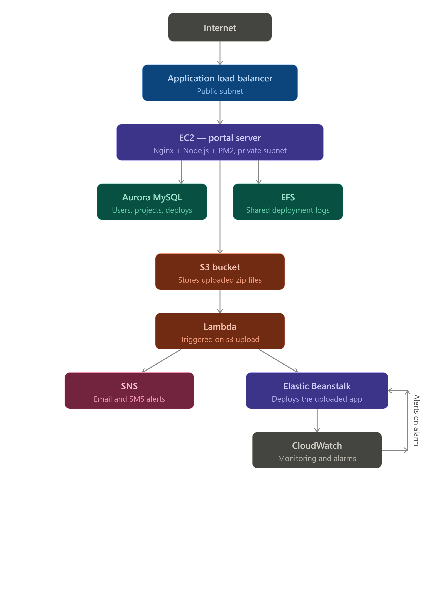

# CloudDeploy — DevOps Deployment Portal

A production-style DevOps deployment portal built on AWS.
Developers upload their app ZIP and click Deploy.
The system handles provisioning, deployment, notifications
and monitoring automatically.

## Architecture

## Tech Stack
- Frontend: React
- Backend: Node.js + Express
- Database: Aurora MySQL
- Status Storage: DynamoDB
- Object Storage: S3
- Compute: EC2
- Deployment Target: Elastic Beanstalk
- Automation: Lambda
- Notifications: SNS
- Shared Storage: EFS
- Monitoring: CloudWatch
- Networking: VPC, ALB, Auto Scaling Group

## Phases
- Phase 1:  Planning & Setup ✅
- Phase 2:  AWS Networking (VPC)
- Phase 3:  AWS Infrastructure
- Phase 4:  Linux Server Setup
- Phase 5:  Backend Development
- Phase 6:  Frontend Development
- Phase 7:  Database Integration
- Phase 8:  S3 Upload Integration
- Phase 9:  Lambda Deployment Automation
- Phase 10: Elastic Beanstalk
- Phase 11: SNS Notifications
- Phase 12: Monitoring & Logging
- Phase 13: Production Deployment
